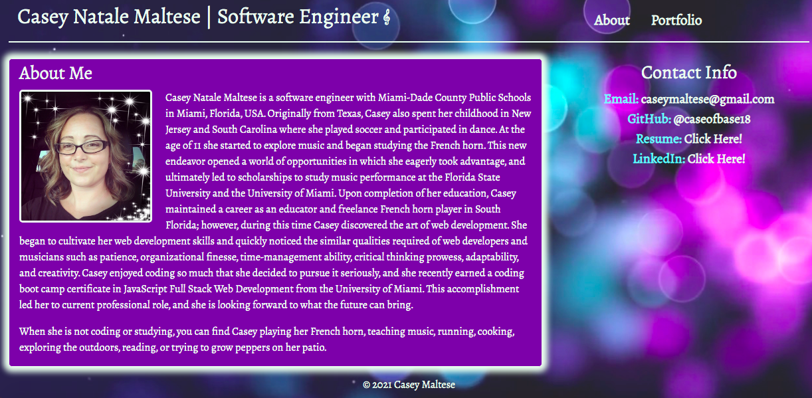
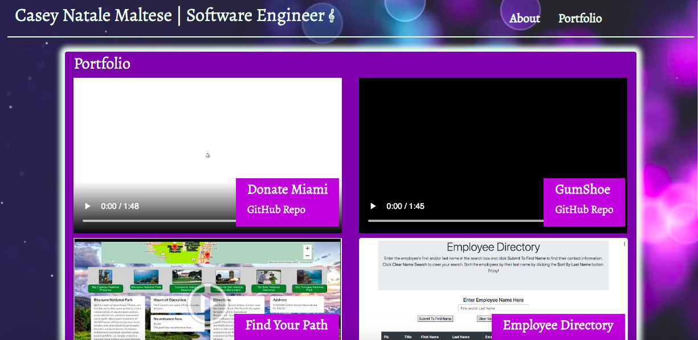

# My bio

This page features my bio and current portfolio. It has my name, a photo, a brief biography, contact info, current resume, and links to my GitHub repository and my LinkedIn page.  The navigation bar contains links to my About page and my Portfolio page.  My porfolio contains videos group projects I have worked on and imagesapplications I created.  The videos and images also include the deployed links as well as links to their respective GitHub repos.  This page was created using HTML, CSS, and Bootstrap. 

Deployed: https://caseofbase18.github.io/bio/

Bio page: 
Portfolio: 